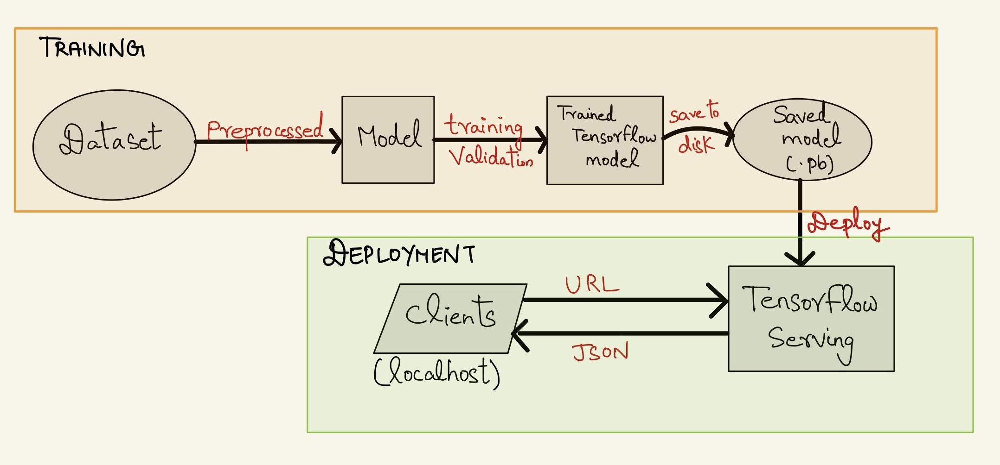
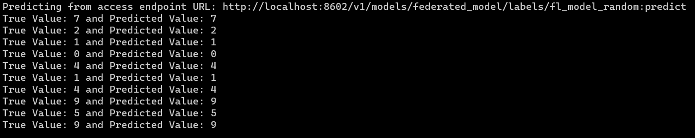
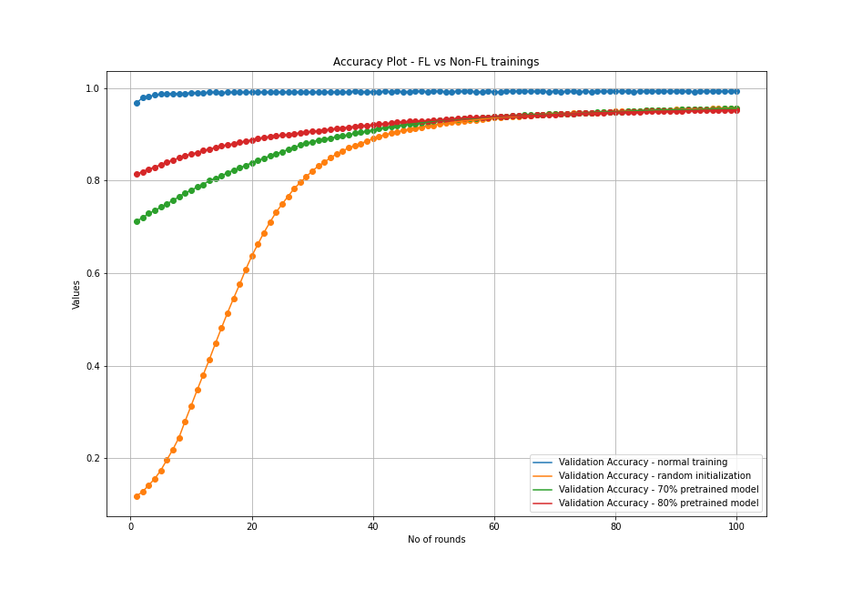

# Deploying federated trained models using tensorflow serving and docker

This project proclaims a **pipeline** that trains models using federated learning and deploys the trained models using `tensorflow serving` and `docker`, which can be accessed by an `endpoint`.



## Author

- [@Jithin Sasikumar](https://www.github.com/Jithsaavvy)

<h2 align="left">Languages and Tools</h2>
<p align="left"><a href="https://www.python.org" target="_blank" rel="noreferrer"></a><a href="https://www.tensorflow.org" target="_blank" rel="noreferrer"></a><a href="https://www.docker.com/" target="_blank" rel="noreferrer"></a><a href="https://numpy.org/" target="_blank" rel="noreferrer"> </a> </p>

## Description

The project is an amalgamation of **research** (federated training and comparison with normal training), **development** (data preprocessing, model training etc.) and **deployment** (model serving). Nowadays, the requirement to deploy and deliver any machine learning models has become a top priority in the industry.

[Federated learning](https://en.wikipedia.org/wiki/Federated_learning) is a machine learning technique that trains an algorithm across multiple decentralized edge devices or servers locally without exchanging the data. This works in contrast to traditional machine learning techniques that are centralized, uploading data from all sources to centralized server for training. It addresses serious isssues like data privacy etc.
For the sake of simplicity and demonstration, `deep Convolutional Neural Network (convnet)` is trained on `MNIST` dataset in both federated and non-federated way. Training an MNIST model is quite simple, but how does it work when trained using federated learning and compare to conventional training? **Well**, the answer is what the project exemplifies.

[TensorFlow Serving](https://www.tensorflow.org/tfx/guide/serving) is a high-performance serving system for machine learning models which is designed for production environments. It makes it easy to deploy new algorithms and models with the same server architecture and APIs. For more information, click [here](https://www.tensorflow.org/tfx/tutorials/serving/rest_simple). [Docker](https://www.docker.com/) eases the developers to package applications or software which can be easily reproduced on another machine. It uses containers to pack any applications with its dependencies to deploy in another environment.

### Pipeline

First, the `MNIST` dataset (readily included in `tf datasets` ) is loaded and preprocessed. The `convnet` model is trained by conventional(normal) training procedure and saved as `.h5` files in [pretrained_models](./pretrained_models/) directory. They are needed for federated training and analysis. The normal model's training metrics are dumped to [results](./results/) directory as `pickle` files. 

Secondly, the preprocessed dataset is transformed in the format that favors federated training. For FL, `Tensorflow Federated (TFF)` library is used. More detailed information about `TFF`, federated dataset and other implementation details can be found [here](https://www.tensorflow.org/federated). 

Federated training is done in two ways:
1. FL training of randomly initialized model (respective model doesn't know anything about the data).
2. FL training of pre-trained model (respective model is pre-trained (i.e.) They are normally trained without FL, so that the models will know something about the data before federated training). For that purpose, models `(.h5)` saved in [pretrained_models](./pretrained_models/) are used. The trained weights are pushed to the initial state of the federated training process.
    - **Note:** Pre-training doesn't happen completely (i.e.) The models are not trained to full `epochs` with highest accuracy. In this case, two models pre-trained with $70\\%$ and $80\\%$ `validation accuracy` are used for FL training.

Each model is trained for `100 rounds` for FL. After training, they are saved to [saved_models](./saved_models/)  in `.pb` format. The existing directory structure of [saved_models](./saved_models/) should be followed in order to deploy using `tf-serving`. The respective training, validation metrics and plots are saved to the [results](./results/) directory. The complete source code is found at [src](./src/) directory. Refer each `documentation` for detailed understanding of the code. The detailed analysis of results, inferences, their comparison with visualizations are provided in [Result_analysis.ipynb](./Result_analysis.ipynb)  

Now, as we have all the trained models saved and ready, it's time for deployment. For that, `tensorflow-serving` is used. It can be done by means of `docker`. Just, pull the `tf-serving` image, add the saved models to the image, build it to a docker container locally from local machine and serve it to tf-serving on a `localhost` which can be accessed by an `access endpoint URL`. But as of now, I had only deployed the container in a `locahost` but this can be made more intuitive by hosting it in any cloud servers.

## Run locally

Clone the project

```bash
  git clone <repository_url>
```

Navigate to the project directory

```bash
  cd <cloned_repository_name>
```

Install dependencies

```bash
  pip install -r requirements.txt
```

Initialize training

For FL training

```bash
  python3 src/federated_convnet_training.py
```
For normal training

```bash
  python3 src/baseline_convnet_training.py
```
**Note:** Assign necessary parameter variables and path in the [config.py](src/utilities/config.py). If it throws any error, please ensure that valid `PATH_NAMES` and `parameter` values are used.

For predicting on test data, run the following command to infer and print `true, predicted` values.

```bash
   python3 src/inference.py
```

### Let's deploy!! 

Before proceeding, make sure to install `Docker` for your `OS` [here](https://docs.docker.com/get-docker/)

After installing `Docker`, run the below command in a **terminal** or **command prompt** to confirm that `Docker` has been successfully installed

```bash
    docker run hello-world
```

Pull the `tensorflow-serving` image from `Dockerhub` in a terminal

```bash
    docker pull tensorflow/serving
```

Run `tf-serving` docker image

```bash
    docker run -it -v ./Deploying_federated_trained_models_using_tensorflow_serving_and_docker:/federated_model_serving -p 8602:8602 --entrypoint /bin/bash tensorflow/serving
```

Our directory is pushed into the image. Now, to serve all models with version labels, use [model.config](./model.config) to define the labels for every model versions.

```bash
    tensorflow_model_server --rest_api_port=8602  --allow_version_labels_for_unavailable_models --model_config_file=./model.config
```

This should give an `endpoint URL` to access the model via `localhost`. Assign the `endpoint URL` from the terminal given by the server to `API_ENDPOINT_URL` variable in [config.py](src/utilities/config.py) and again run

```bash
   python3 src/inference.py
```

This time, the predictions are given from the same model deployed in the tf-server rather than the one saved in your disk. The results are illustrated in the `screenshots` section below.

**Note:** For every `HTTP request`, the server returns the predictions via `JSON responses`. Any tools like [Postman](https://www.postman.com/) can also be used.

## Results

### Predictions from model deployed in server via localhost


### Predictions from the saved model


### FL vs Non-FL plot

It's only a gist. Detailed analysis and inferences are described in [Result_analysis.ipynb](./Result_analysis.ipynb)  



**Note:
All the codes are refactored, well defined, structured and documented based on the guidelines.**

## Feedback

If you have any feedback, please reach out to me at jithsasikumar@gmail.com


## References

[Federated learning - Wikipedia](https://en.wikipedia.org/wiki/Federated_learning)

[Tensorflow Serving](https://www.tensorflow.org/tfx/guide/serving)

[TF-Serving Github](https://github.com/tensorflow/serving)

[Tensorflow federated](https://www.tensorflow.org/federated)

[Federated learning - Image classification](https://www.tensorflow.org/federated/tutorials/federated_learning_for_image_classification)

[TF-Serving config](https://www.tensorflow.org/tfx/serving/serving_config)

[neptune.ai blog](https://neptune.ai/blog/how-to-serve-machine-learning-models-with-tensorflow-serving-and-docker)


